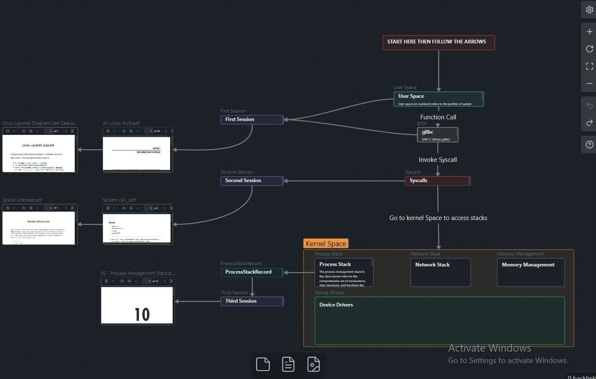

# Embedded Linux-Hazem
---
- This is an obsidian vault for the first part of the Embedded Linux Course (Linux Internals), to access the notes if you don't know how to use obsidian vaults just open them from the `Notes` folder.

