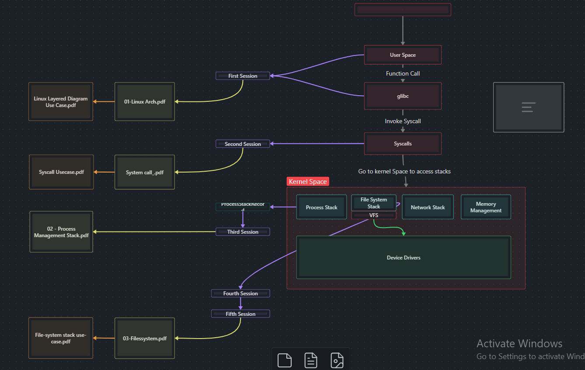

# Embedded Linux-Hazem
---
## Overview

This is an obsidian vault for the first part of the Embedded Linux Course (Linux Internals), to access the notes if you don't know how to use obsidian vaults just open them from the `Notes` folder.

## How to use

There are two methods to use this study material
1. Use website of the course --> [Bullet Guru](https://bullet.guru/)
2. Use the following order while reading in the vault and follow the *arrows* --> 
	1.  Linux System Architecture          ***DONE***
	2. System Call Interface                   ***DONE***
	3. Process Management Stack        ***DONE***
	4. Filesystem Stack                          ***DONE***
	5. Terminal & Shell Scripting
	6. Networking
	7. Access Control & User Management
	8. Monitoring Linux

